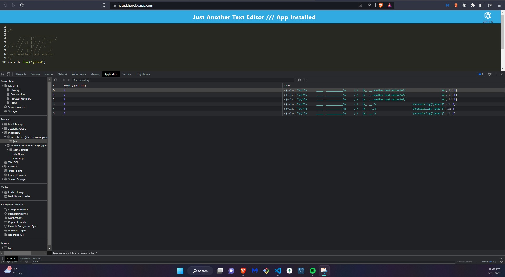

# **Module19-PWAtextEditor**


## Table of Contents: 
#### [Description](#description)
#### [Heroku](#heroku)
#### [Installation](#installation)
#### [Usage](#usage)
#### [ScreenShot](#screenshot)
#### [License](#license)
#### [Questions](#questions) 

## Description
### PWA Text Editor Using IndexDB Deployed to Heroku 

## Heroku
### https://jated.herokuapp.com/

## Installation
### Run in bash terminal of cloned repo
```
npm run install // to install app

npm run start // to start app
```

## Usage

### Visit https://jated.herokuapp.com/ to use app
### type away or click button in url bar to install locally 

## Screenshots
### IDB Screenshot
### 
### Manifest Screenshot
### 
### Service Worker Screenshot
### 

## License
### The MIT License  [](https://opensource.org/licenses/MIT) 
#### https://www.mit.edu/~amini/LICENSE.md


## Questions
#### Github Profile: https://github.com/KlyDesign

